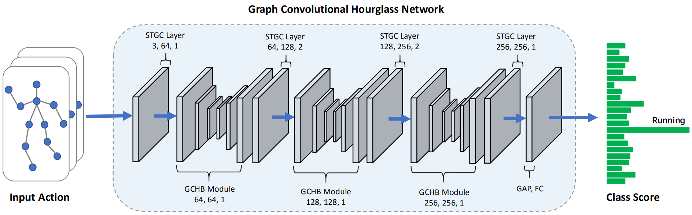

# GCHN
*The PyTorch implementation of ''Graph Convolutional Hourglass Network for Skeleton-based Action Recognition'' (Accepted by ICME 2021).*

<!--  -->

# Dependencies
- Python 3.6
- PyTorch 1.2.0
- PyYAML, tqdm, tensorboard
     
# Contact
For any questions, please feel free to contact: `yiranupup@gmail.com`
